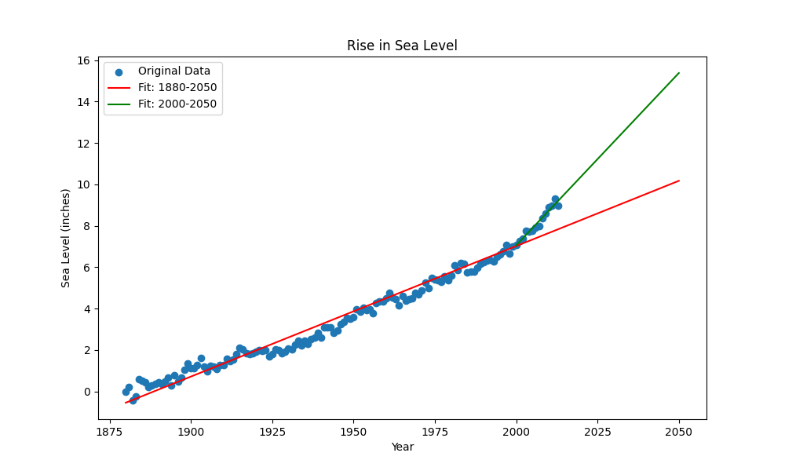

# Sea Level Predictor

  
*Predicted global average sea level rise based on historical data.*

---

## 📈 Project Overview

This project is a **Sea Level Predictor** that analyzes global average sea level data from 1880 to the present day, and projects future sea level changes through the year 2050 using **linear regression**.

The project was built using:

- **Pandas** – for data loading and manipulation  
- **Matplotlib** – for data visualization  
- **SciPy (linregress)** – to calculate regression line for predictions

---

## ✅ What We Did

### 1. Data Import  
- Imported the dataset `epa-sea-level.csv` using Pandas  
- Focused on the `Year` and `CSIRO Adjusted Sea Level` columns

### 2. Scatter Plot  
- Created a scatter plot showing actual sea level measurements over time

### 3. First Line of Best Fit (1880 - present)  
- Used `scipy.stats.linregress()` to compute the regression line from 1880 to the most recent year  
- Extended this line to **predict sea level up to 2050**

### 4. Second Line of Best Fit (2000 - present)  
- Isolated data from year 2000 onward  
- Created a second regression line and extended it to 2050  
- This shows the **more recent trend**, which is often steeper than the historical average

---

## 📊 Visualization Details

- **X-axis:** Year  
- **Y-axis:** Sea Level (inches)  
- **Title:** Rise in Sea Level  
- Includes two trend lines (1880–2050 and 2000–2050)  
- Saved as `sea_level_plot.png`

---

## 🎯 Project Goal

This project demonstrates the use of regression analysis to **predict future sea level rise** based on historical data. It also highlights how recent data trends can differ significantly from long-term averages, emphasizing the importance of up-to-date environmental monitoring.

---

This is part of the freeCodeCamp Data Analysis with Python Projects.  
For full instructions, see:  
[https://www.freecodecamp.org/learn/data-analysis-with-python/data-analysis-with-python-projects/sea-level-predictor](https://www.freecodecamp.org/learn/data-analysis-with-python/data-analysis-with-python-projects/sea-level-predictor)
